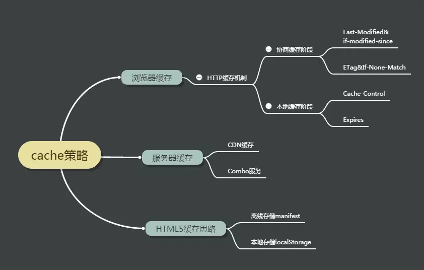
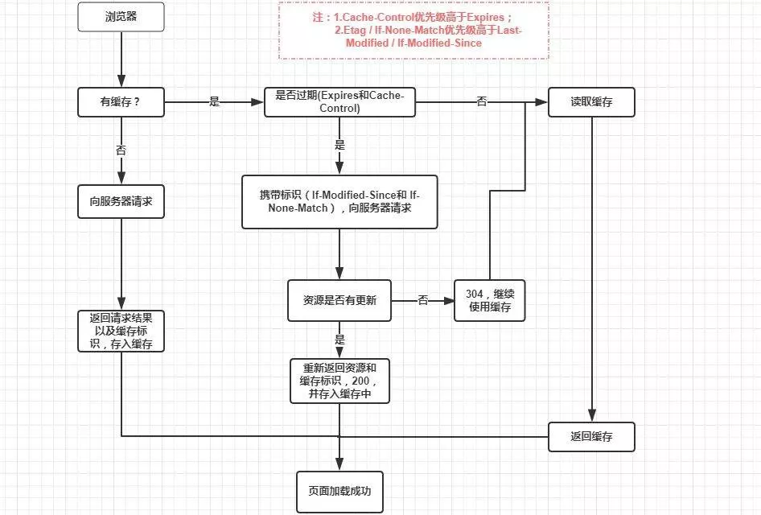

## 浏览器缓存机制

缓存是浏览器的一种机制，可以把请求过的 web 资源（html、css、js、图片等）拷贝一份副本存储在浏览器中，并根据请求配置选择是否使用该副本。</br>

## 缓存作用

1. 减少网络带宽消耗
2. 降低服务器压力
3. 减少网络延迟，使页面的打开速度更快，增加用户体验

根据不同的划分规则，缓存可以分为以下几种：</br>


## 浏览器缓存规则定义位置

可以在 HTTP 协议头 和 HTML 页面的 meta 标签 中定义。</br>

meta 标签定义：

```js
<!-- Pragma 是 http1.0 版本中给客户端设定缓存方式之一 -->
<meta http-equiv="Pragma" content="no-cache">
```

上述代码的含义：浏览器当前页面不被缓存，每次访问都向服务器请求。</br>

http 协议头定义：</br>

与缓存有关的消息报头有 `expires`、`cache-control`——本地缓存阶段，`Last-Modified`、`If-modified-since`，`Etag`，`If-none-match`——协商缓存 等。</br>

## 缓存分类

根据是否需要向服务器发送资源请求，分为**强缓存**和**协商缓存**。
强缓存: 意味着强制使用缓存;</br>
协商缓存: 意味着每用一次缓存都要协商一次。 强缓存和协商缓存都允许使用情况下，优先强缓存。</br>

### 强缓存

强缓存的控制字段：</br>

HTTP1.0：`Expires`</br>

HTTP1.1 ：`Cache-Control`</br>

判断过程：请求再次发起 -> 浏览器根据 `expires` 和 `cache-control` 判断目标资源是否命中"强缓存" -> 若命中，直接从缓存获取资源，不再与服务器发生通讯。</br>

如果 `cache-control` 与 `expires` 同时存在，以 `cache-control` 为主，继续使用 `expires` 的目的就是向下兼容。</br>

:::tip
`Expire` 已经被 `Cache-Control` 替代，原因在于 `Expires` 依赖于本地时间，它控制缓存的原理是使用客户端的时间与服务端返回的时间做对比，那么如果客户端与服务端的时间因为某些原因（例如时区不同；客户端和服务端有一方的时间不准确；用户修改了本地时间）发生误差，那么强制缓存则会直接失效。
:::

`Cache-Control` 取值：</br>

在 HTTP/1.1 中，`Cache-Control` 是最重要的规则，主要用于控制网页缓存，主要取值为：</br>

`public`：所有内容都将被缓存（客户端和代理服务器都可缓存）</br>
`private`：所有内容只有客户端可以缓存，Cache-Control 的默认取值</br>
`no-cache`：客户端缓存内容，但是是否使用缓存则需要经过协商缓存来验证决定</br>
`no-store`：所有内容都不会被缓存，即不使用强制缓存，也不使用协商缓存</br>
`max-age=xxx` (xxx is numeric)：缓存内容将在 xxx 秒后失效</br>
`must-revalidate`: 强制浏览器严格遵守你设置的 cache 规则</br>
`proxy-revalidate`: 强制 proxy 严格遵守你设置的 cache 规则</br>

强缓存流程：</br>


### 协商缓存

协商缓存就是强制缓存失效后，浏览器携带缓存标识向服务器发起请求，由服务器根据缓存标识决定是否使用缓存的过程，主要有以下两种情况： 协商缓存生效，返回 304 && 协商缓存失效，返回 200 和请求结果。</br>

协商缓存流程：</br>


协商缓存的控制字段：</br>

HTTP1.0：`Last-Modified` && `If-Modified-Since`</br>
HTTP1.1 ：`Etag` && `If-None-Match`</br>

### `Last-Modified` 与 `If-Modified-Since`

`Last-Modified` 是服务器响应请求时，返回该资源文件在服务器最后被修改的时间</br>

流程：</br>

1. 首次请求
2. 服务器告知启用协商缓存规则，并在响应头中带上 `Last-Modified`，告知缓存到期时间
3. 随后的每次请求，请求头上都会携带 `If-Modified-Since`，该值等于上一次响应头中的 `Last-Modified` 的值
4. 服务器收到 `If-Modified-Since` 后，会将该属性的值与服务器上资源的最后修改时间进行匹配，从而判断资源是否发生了变化
5. 如果发生变化会返回一个完整的响应内容，在响应头中添加新的 `Last-Modified` 值，否则，只返回 `header` 部分，状态码为 304，响应头不会再添加 Last-Modified

弊端: Last-Modified 无法正确感知文件的变化，譬如说，文件的编辑时间修改了而内容没有修改，或者修改文件速度太快，几毫秒就改一次文件，If-Modified-Since 只能检测秒级的变化. 为了解决这个问题，Etag 作为 Last-Modified 的升级版，因时而生。 Etag 是通过标识字符串来辨别文件内容是否发生修改的，文件内容不一致才会生成新的标识字符串，这就弥补了 Last-Modified 时间戳的不足，通过 Etag 可以精准的感知文件的变化。</br>

### Etag && If-None-Match

Etag 是服务器响应请求时，返回当前资源文件的一个唯一标识(由服务器生成)</br>

流程：</br>

1. 首次请求
2. 服务器启用协商缓存情况下，会在响应头中带上 Etag
3. 随后每次请求，请求头上都会带上 If-None-Match，该值等于上一次响应头中的 Etag 的值
4. 服务器收到 If-None-Match 后，会进行比对，从而判断资源是否发生变化
5. 如果变化返回一个完整响应内容，在响应头上添加新的 Etag 值，否则返回 304,响应头不会在添加 Etag

弊端: Etag 的生成需要服务器付出额外的开销，会影响服务端性能。</br>

:::tip
Etag 并不能替代 Last-Modified，只能作为 Last-Modified 的补充和强化存在，当 Etag 和 Last-Modified 同时出现时，以 Etag 为准。
:::

整个缓存机制的流程图：</br>



## 不能被缓存的请求

1. HTTP 信息头中包含 `Cache-Control:no-cache，pragma:no-cache（HTTP1.0）`，或 `Cache-Control:max-age=0` 等告诉浏览器不用缓存的请求
2. 需要根据 Cookie，认证信息等决定输入内容的动态请求是不能被缓存的
3. 经过 HTTPS 安全加密的请求
4. POST 请求无法被缓存
5. HTTP 响应头中不包含 `Last-Modified/Etag`，也不包含 `Cache-Control/Expires` 的请求无法被缓存

## 用户操作行为与缓存


## 浏览器中的操作对缓存的影响

1. 强制刷新 – 当按下 ctrl+F5 来刷新页面的时候, 浏览器将绕过各种缓存(本地缓存和协商缓存), 直接让服务器返回最新的资源
2. 普通刷新 – 当按下 F5 来刷新页面的时候,浏览器将绕过本地缓蹲来发送请求到服务器, 此时, 协商缓存是有效的
3. 回车或转向 – 当在地址栏上输入回车或者按下跳转按钮的时候, 所有缓存都生效
